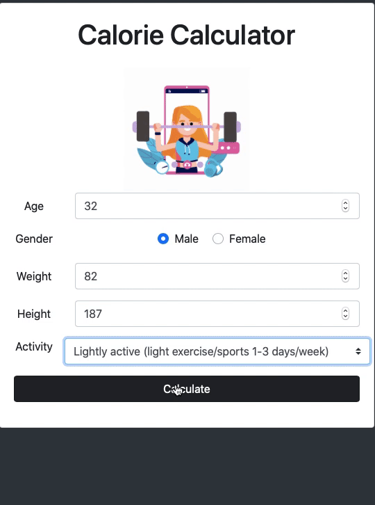

# Calories Calculator
The Calorie Calculator can be used to estimate the number of calories a person needs to consume each day.

This is ad free tool you can use :)

## Deployment

Open this [calories calculator](https://codewithgauri.github.io/caloriescalculator.github.io) to see Demo page.

## Contributing
Pull requests are welcome. For major changes, please open an issue first to discuss what you would like to change.

Please make sure to update tests as appropriate.